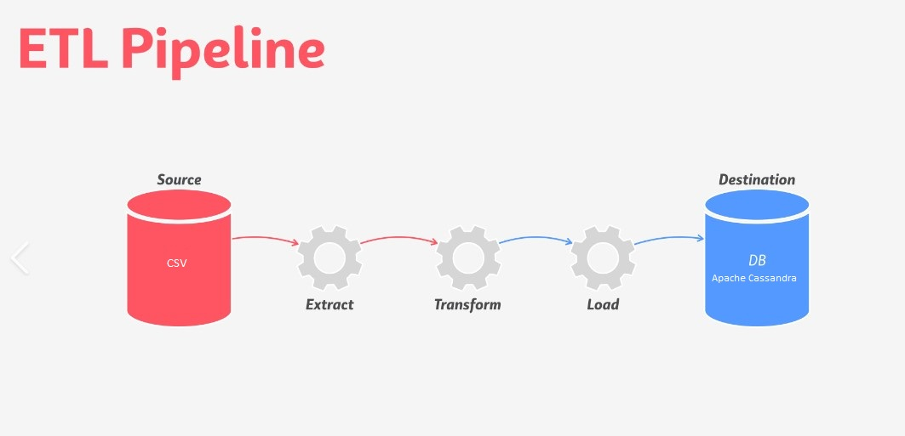

# 2022-ApacheCassandra-ETL-DataModeling
 
<h1 align="center">
   
  
   
  Development Technologies 
   
</h1>

  
  
  
  
 
  

  <a href="#Purpose">Purpose</a> •
  <a href="#how-to-use">How It Work</a> •
  <a href="#CodeFlow">Code Flow</a> •
  <a href="#Credit">Credit</a> •
  <a href="#Screen">Screen</a> •

## Purpose
Model & Denormalize the DB for the Needed Queries , Optimizing for Fast, Responsive Reads
ETL pipeline that transfers data from a set of CSV files within a directory to create a streamlined CSV file to model and insert data into Apache Cassandra tables.
* processing the dataset to create a denormalized it for 
* modeling the data tables keeping in mind the queries 
* provided queries that  will need to model  data tables for
* loading the data into tables you create in Apache Cassandra and run your queries & test    

## How It Work
* Either use a Docker images or run things locally . ( modify the connection to db part )
* Have the initial data in the event folder

## CodeFlow
* Set the path to automate file exteaction 
* Either Using Pandas or file read to stream data ( code for both is provided )
* Clean and format based on desired queries
* Model & Denormalize the DB for the Needed Queries , Optimizing for Fast, Responsive Reads
* Automate the load into the db

## Credit
Amanda K Moran : (https://www.linkedin.com/in/amanda-kay-moran/)
 
Udacity : (https://www.udacity.com/course/data-engineering-with-microsoft-azure-nanodegree--nd0277)

This software uses the following open source packages:

See requirements.txt

---

> Website (https://marshi00.azurewebsites.net) -
> GitHub (https://github.com/Marshi00) - 
> Linkedin (https://www.linkedin.com/in/m-arshian-7516901a2)

